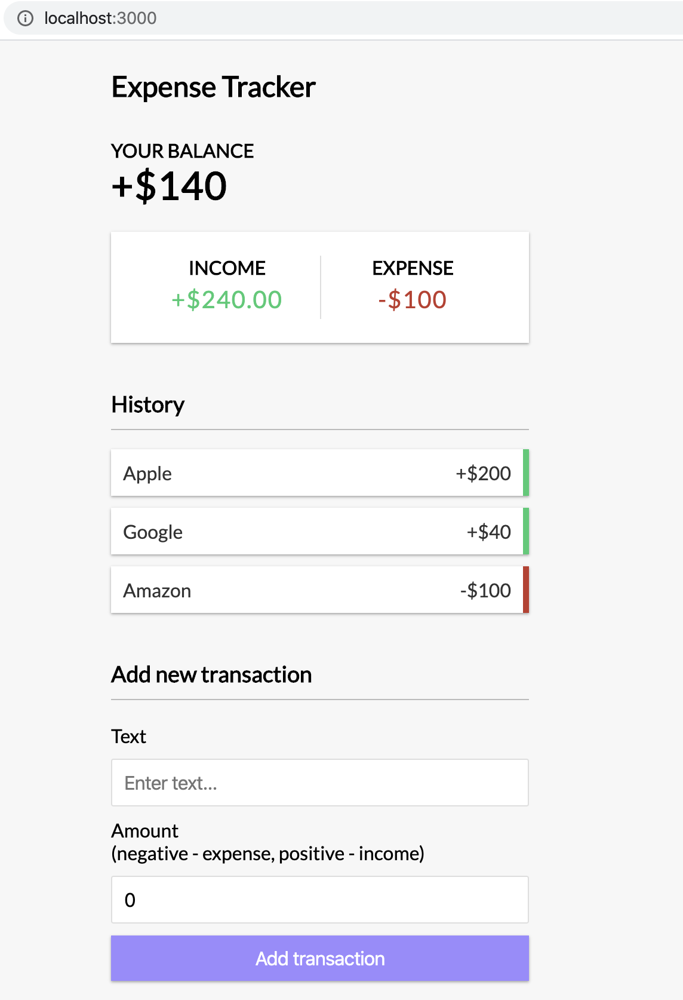
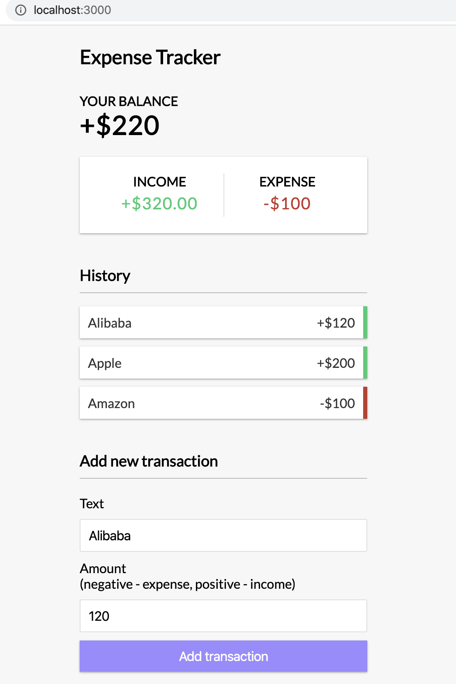

# Front End & Back End Application

This is a full stack MERN app project including a backend API with Express and MongoDB and a frontend app with React hooks and context API.

## Back End

This project was started with `Express.js`. In action with `mongoose`.

## Front End

### Simple expense tracker using React hooks & context

This project was bootstrapped with [Create React App](https://github.com/facebook/create-react-app). And in action with react Hooks and Context API.

### Online source

[http://i.ioodu.com/react-hooks-context-app/](http://i.ioodu.com/react-hooks-context-app/)

### Usage

```
  cd client

  npm install

  # Run on http://localhost:3000
  npm start

  # Build for prod
  npm run build
```

### Screenshots




