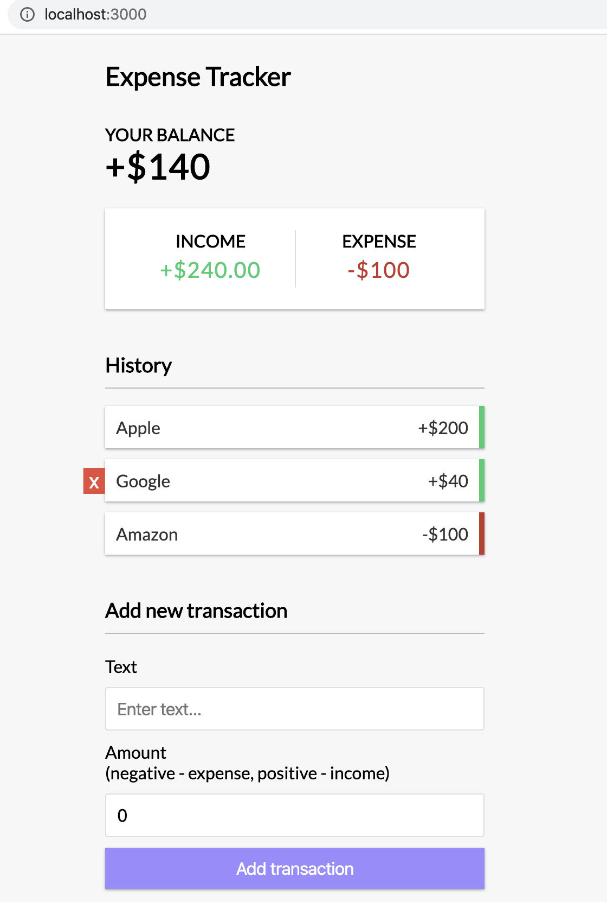
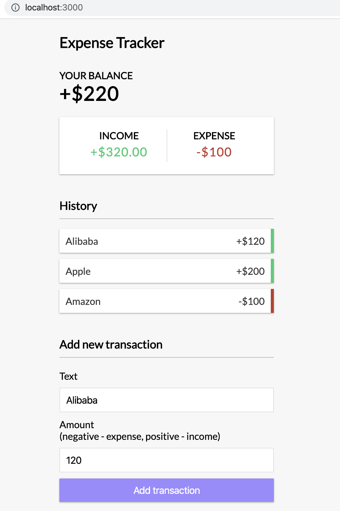

# Simple expense tracker using React hooks & context

This project was bootstrapped with [Create React App](https://github.com/facebook/create-react-app). And in action with react Hooks and Context API.

# Online source
[http://i.ioodu.com/react-hooks-context-app/](http://i.ioodu.com/react-hooks-context-app/)
# Usage

```
  npm install

  # Run on http://localhost:3000
  npm start

  # Build for prod
  npm run build
```

# Screenshots




